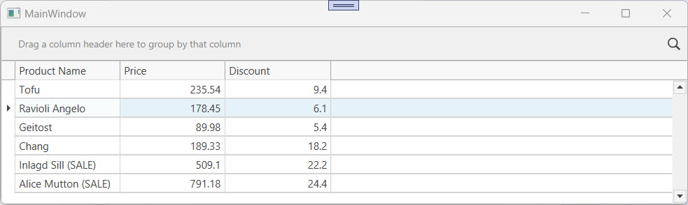

<!-- default badges list -->

[](https://supportcenter.devexpress.com/ticket/details/E2020)
[](https://docs.devexpress.com/GeneralInformation/403183)
[](#does-this-example-address-your-development-requirementsobjectives)
<!-- default badges end -->

# WPF Data Grid – Display Custom Text in Cells Based on a Condition

In this example, the [`GridControl`](https://docs.devexpress.com/WPF/DevExpress.Xpf.Grid.GridControl) changes cell display text when a specific condition is met. 

If the **Discount** value is greater than 20, the grid appends **(SALE)** to the **Product Name**.



Use this technique when you need to:

- Add labels or status markers to cell values.
- Update cell text dynamically while the original data remains unchanged.
- Improve readability and highlight key values.

## Implementation Details

The example includes [code-behind](#code-behind) and [MVVM](#mvvm) techniques.

### Code-Behind

Handle the [`CustomColumnDisplayText`](https://docs.devexpress.com/WPF/DevExpress.Xpf.Grid.GridControl.CustomColumnDisplayText) event to replace or extend the text displayed in a cell based on custom conditions.

```csharp
void grid_CustomColumnDisplayText(object sender, CustomColumnDisplayTextEventArgs e) {
    if (e.Column.FieldName == "ProductName") {
        decimal discount = (decimal)e.GetCellValue("Discount");
        if (discount > 20)
            e.DisplayText += " (SALE)";
    }
}
```

### MVVM

Bind the [CustomColumnDisplayTextCommand](https://docs.devexpress.com/WPF/DevExpress.Xpf.Grid.GridControl.CustomColumnDisplayTextCommand) to a view model command to change the text displayed in a cell based on custom conditions.

```csharp
public void OnCustomColumnDisplayText(CustomColumnDisplayTextEventArgs e) {
    if (e.Column.FieldName == "ProductName") {
        decimal discount = (decimal)e.GetCellValue("Discount");
        if (discount > 20)
            e.DisplayText += " (SALE)";
    }
}
```

## Files to Review

### Code-Behind

* [MainWindow.xaml](./CS/DisplayCustomText_CodeBehind/MainWindow.xaml) ([VB](./VB/DisplayCustomText_CodeBehind/MainWindow.xaml))
* [MainWindow.xaml.cs](./CS/DisplayCustomText_CodeBehind/MainWindow.xaml.cs#L20-L25) ([VB](./VB/DisplayCustomText_CodeBehind/MainWindow.xaml.vb#L22-L29))

### MVVM

* [MainWindow.xaml](./CS/DisplayCustomText_MVVM/MainWindow.xaml) ([VB](./VB/DisplayCustomText_MVVM/MainWindow.xaml))
* [MainViewModel.cs](./CS/DisplayCustomText_MVVM/MainViewModel.cs#L32-L40) ([VB](./VB/DisplayCustomText_MVVM/MainViewModel.vb#L76-L84))

## Documentation

* [`GridControl`](https://docs.devexpress.com/WPF/DevExpress.Xpf.Grid.GridControl)
* [Format Cell Values](https://docs.devexpress.com/WPF/400449/controls-and-libraries/data-grid/appearance-customization/format-cell-values)
* [GridControl.CustomColumnDisplayText](https://docs.devexpress.com/WPF/DevExpress.Xpf.Grid.GridControl.CustomColumnDisplayText)
* [GridControl.CustomColumnDisplayTextCommand](https://docs.devexpress.com/WPF/DevExpress.Xpf.Grid.GridControl.CustomColumnDisplayTextCommand)

## More Examples

* [Display Custom Text Within Data Cells and Groups](https://github.com/DevExpress-Examples/how-to-display-custom-text-within-data-cells-and-groups-t327301)
* [Apply Custom Rules to Group Rows](https://github.com/DevExpress-Examples/how-to-implement-custom-grouping-e1530)

<!-- feedback -->
## Does this example address your development requirements/objectives?

[](https://www.devexpress.com/support/examples/survey.xml?utm_source=github&utm_campaign=wpf-grid-display-custom-text-in-cells&~~~was_helpful=yes) [](https://www.devexpress.com/support/examples/survey.xml?utm_source=github&utm_campaign=wpf-grid-display-custom-text-in-cells&~~~was_helpful=no)

(you will be redirected to DevExpress.com to submit your response)
<!-- feedback end -->
